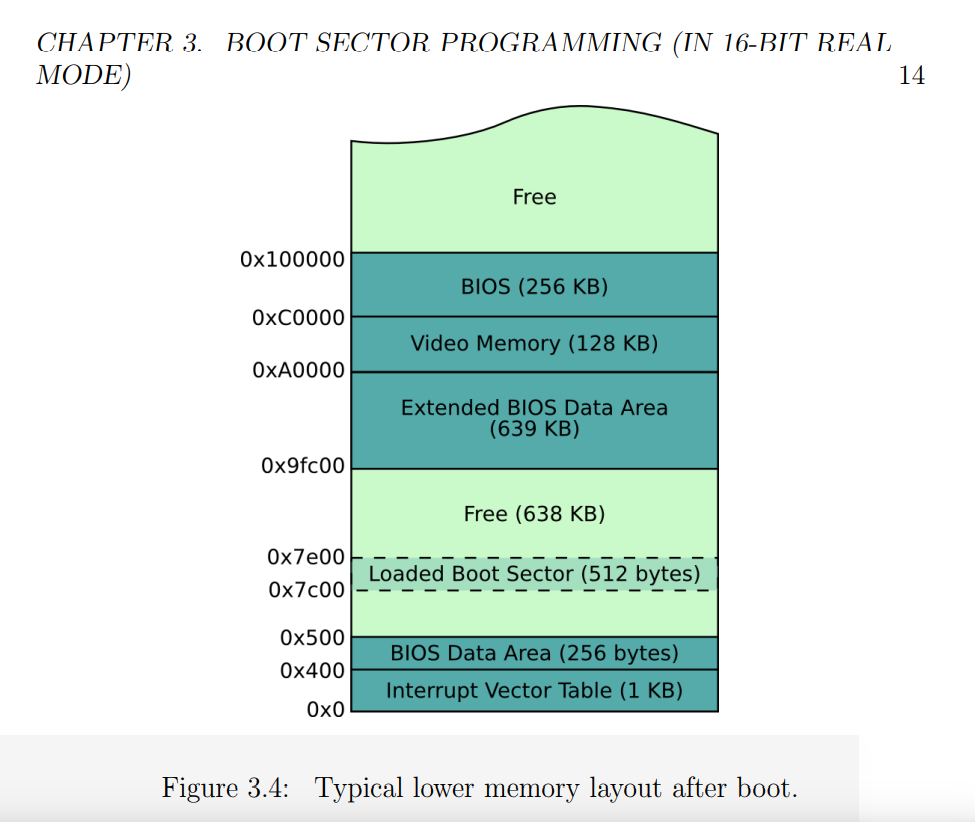

# OS

Let's have a go at creating an OS, and since containers can keep things tidy, let's create inside a Docker container.
First I will walk through the steps done in the [Dockerfile](Dockerfile).

## 1. Create bootsector
The file in [boot](boot/boot_sect_simple.asm) is an assembly language flie, meaning that it
cna be converted to machine language using an assembler like [nasm](https://www.nasm.us/doc/nasmdoc7.html#section-7.13). 
This is how we are going to write the script that gets executed on boot.

What we basically do is copy the asm file to `/boot`, convert to machine code with nasm (installed 
in the container) and then run it with [qemu](https://www.qemu.org/) which is an open source virtualization software.

```bash
nasm -f bin /boot/boot_sect_simple.asm -o /boot/boot_sect_simple.bin
```

The `-f bin` option tells the program to make raw machine code. If we don't add this I think it makes some kind
of package with metadata. We might need this metadata for a more proper boot binary / package, but not for now!

```
# Be careful running this, it's an infinite loop :)
alias qemu='qemu-system-x86_64'
qemu /boot/boot_sect_simple.bin -curses
```


Note that I use the `-curses` flag because if you don't, the virtualization doesn't work in the container.

```bash
root@bcb91febe714:/#  qemu /rootfs/boot/boot_sect_simple.bin
WARNING: Image format was not specified for '/boot/boot_sect_simple.bin' and probing guessed raw.
         Automatically detecting the format is dangerous for raw images, write operations on block 0 will be restricted.
         Specify the 'raw' format explicitly to remove the restrictions.
warning: TCG doesn't support requested feature: CPUID.01H:ECX.vmx [bit 5]
Could not initialize SDL(No available video device) - exiting
```

### Add Text to Boot
I don't know assembly, so I was reading [this article](http://www.sharetechnote.com/html/OS_WritingOS_BootLoader_asm.html)
and playing around with different hex character to add to print messages! It turns out these lines *do* translate to human to some extent:

```assembly
jmp # jump to the line start (hello infinite loop!)
times 510-($-$$) db 0 # fill in '0's from bytes at current position to 510th
dw 0xAA55 ; Write a word (2 bytes) data 0xAA55 at current position. I guess the 55 comes before the AA but I need to read up on assembly!
```

The general idea seems to be that for assembly, you literally have to tell the language to move a byte and then put a letter there. The different registries are called `ax` `bx` `cx` and `dx` and you can reference decimals or bytes. Here are the examples from the document linked above.

```assembly
mov ax , 1234 ;   "store the decimal number 1234 in ax"
mov cx , 0 x234 ; "store the hex number 0 x234 in cx"
mov dx , ’t ’ ;   "store the ASCII code for letter ’t’ in dx"
mov bx , ax ;     "copy the value of ax into bx , so now bx == 1234"
```

And then if we want to say:

 - put in teletype mode to advance the cursor
 - interrupt to change
 - print an ascii character

We would do:

```bash
mov ah, 0x0e ; tty mode
mov al, 'H'
int 0x10
```

And then here is how I changed the file so it prints something quasi meaningful:

```bash
; Hello Dinosaur!

mov ah, 0x0e ; tty mode
mov al, 'H'
int 0x10
mov al, 'e'
int 0x10
mov al, 'l'
int 0x10
int 0x10
mov al, 'o'
int 0x10
mov al, ''
int 0x10
mov al, 'D'
int 0x10
mov al, 'i'
int 0x10
mov al, 'n'
int 0x10
mov al, 'o'
int 0x10
mov al, 's'
int 0x10
mov al, 'a'
int 0x10
mov al, 'u'
int 0x10
mov al, 'r'
int 0x10
mov al, '!'
int 0x10

jmp $ ; jump to current address = infinite loop

; padding and magic number
times 510 - ($-$$) db 0
dw 0xaa55 
```
This is like, me talking directly to my computer! I find this nuts! (meaning cool). 

### How is this going to work?
I'm reading from the [Boot Process](http://www.cs.bham.ac.uk/~exr/lectures/opsys/10_11/lectures/os-dev.pdf) chapter
here, which describes the following flow:
 
 - the computer without an OS has a simple utility, the Basic Input/Output Software (BIOS) that you likely know
about if you've ever done any kind of debugging of your hardward. It's a set of routines that are called when the computer starts, and is mostly about control for disks, screen, memory, keyboard devices. 
 - If all goes well, the operating system is booted from a device. Since there is no way for the software to know where to look, there is a stupid rule that it knows to always look in certain addresses (physical locations) of the disk devices. And tada! We call this the Boot Sector (I've heard of this before!) and it's located at "Cylinder 0, Head 0, Sector 0)" If you've ever reformatted your hard drive you would have seen this little section and probably scratched your head. Good job for not deleting it :) It's identified correctly by ending in a "magic number" `0xaa55`. 

Also from [this lecture](http://www.cs.bham.ac.uk/~exr/lectures/opsys/10_11/lectures/os-dev.pdf) on page 14, we can see how "lower memory" is mapped out when the computer starts up. Look at the little boot sector, he's so happy nestled there!



In computer speak, the BIOS is putting the Boot Sector at `0x7C00` (remember that `0x` indicates it's a hexidecaimal address, and since we have 16 characters we go from 123...def) 

I loaded the file into a graphical hex editor on my local machine to look at the hex from the compiled binary!


Actually, there is a command line tool to do the same:

```bash
# man od --> dump files in octal and other formats
od -t x1 -A n boot_sect_simple.bin
 eb fe b4 0e b0 48 cd 10 b0 65 cd 10 b0 6c cd 10
 cd 10 b0 6f cd 10 b0 00 cd 10 b0 44 cd 10 b0 69
 cd 10 b0 6e cd 10 b0 6f cd 10 b0 73 cd 10 b0 61
 cd 10 b0 75 cd 10 b0 72 cd 10 b0 21 cd 10 00 00
 00 00 00 00 00 00 00 00 00 00 00 00 00 00 00 00
*
 00 00 00 00 00 00 00 00 00 00 00 00 00 00 55 aa
```

You can even try this for the boot loader executables on your host!

```bash
$ od -t x1 -A n /boot/memtest86+.bin 
```

### Improving our Boot Loader

**Data**
Instead of having each character defined separately like that, we can make a declaration of a string with db, which I think
means "declare bytes of data." Let's make one called dinosaur_greeting and see if it produces the same. 
Since we want to know where the string ends, we will make it null terminating (ends in 0).
The other detail I'm adding here is that there should be a Global Offet defined so we are able to take into account the offset of the bootloader. I am still getting the hang of a lot of this, but I was able to write a simple
boot loader that prints a screen, and includes a second file with a function to do this.

**Registers**
At this point I wanted to improve the above so I could work with strings instead of
individual characters, and functions instead of single commands.
Since we are getting into defining strings, we logically need places to put them.
Up to this point we have been using the main memory, and we can do a little better.
This is where registers come in - they are temporary storage locations for local variables.
A register will make it easy to read and write without needing to specify specific memory addresses.

**Functions and Includes**
I won't go into detail, but there are ways to write functions (that can be reused)
and even put them in separate files and "include" one in another. My final Boot Loader
assemly script wound up looking like this:

```bash
;
; A boot sector that says "Hello Dinosaur" using a print function
;

[org 0x7c00] ; Tell the assembler where this code will be loaded

mov bx , dinosaur_greeting     ; Use BX as a parameter to our function , so
call print_string              ; we can specify the address of a string.
jmp $ ; Hang

%include "print_string.asm"

;
; Data
;

dinosaur_greeting :
    db ' Hello Dinosaur! ' , 0 ;

; Padding and magic number.
times 510 -( $ - $$ ) db 0
dw 0xaa55

```

#TODO add 0-bootdinosaur.png here##

with a function to print things:

```bash
;
; print_string.asm
;

print_string:
    pusha           ; push all register values to the stack
    mov ah, 0x0e
loop:
    mov al, [bx]
    int 0x10
    add bx, 1
    cmp al, 0
    jne loop
    popa            ; restore original register values
    ret
```

Some fun things to try might be:
 - create a boot loader that prints a randomly selected string

## 2. Load from Disk

As I was learning about the Boot Sector and BIOS, I felt very skeptical that a
computer's entire start routine could fit in 512 bytes. Like, really? It turns out
this intuition was on spot. Most operating systems will retrieve the remainder of
code from disk --> memory --> execution. BIOS also gives us functions to manipulate
data on disks, so I think we will look at that next.

### Segments
There are special registers called segments, with names `cs`, `ds`, `ss`, and `es`
and here is where


This is really interesting - the oldest CPU in Intel's family is called the Intel 8086,
and it's *so* old that it only supported 16 bit instructions and no memory protection, 
meaning that a user could interact with the kernel's memory directly. All modern Intel 
emulators start in this mode so that they can continue happily in it, or switch to a more
advanced mode (I don't totally understand this switch yet so I won't talk about it).

Next we should talk about how to organize memory, but I'll save that for another round of work, because I
want to jump to work on something else for a bit.
