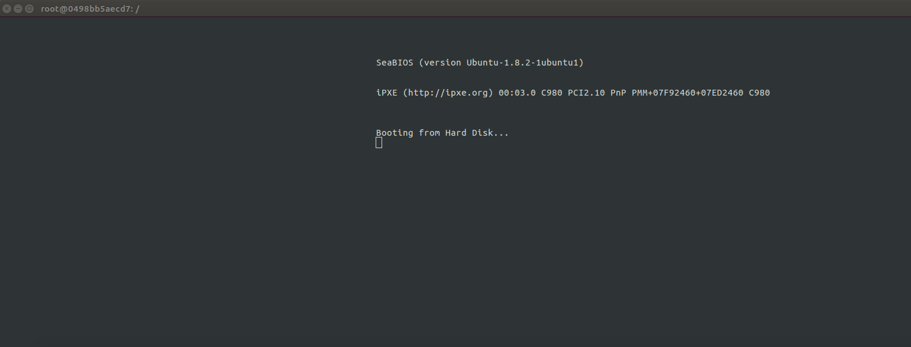
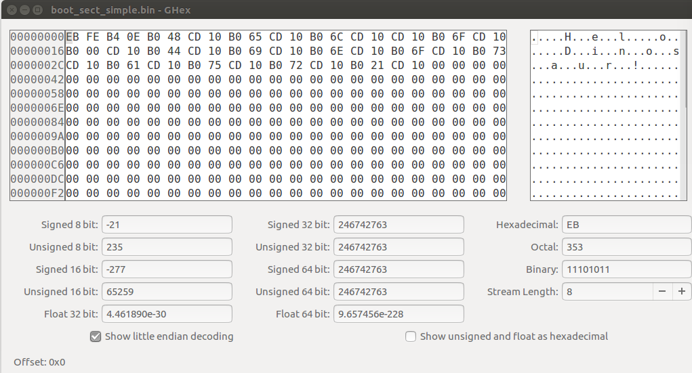

# OS

Let's have a go at creating an OS, and since containers can keep things tidy, let's create inside a Docker container.
First I will walk through the steps done in the [Dockerfile](Dockerfile).

## 1. Create bootsector
The file in [boot](boot/boot_sect_simple.asm) is an assembly language flie, meaning that it
cna be converted to machine language using an assembler like [nasm](https://www.nasm.us/doc/nasmdoc7.html#section-7.13). 
This is how we are going to write the script that gets executed on boot.

What we basically do is copy the asm file to `/boot`, convert to machine code with nasm (installed 
in the container) and then run it with [qemu](https://www.qemu.org/) which is an open source virtualization software.

```bash
nasm -f bin /boot/boot_sect_simple.asm -o /boot/boot_sect_simple.bin && \

# Be careful running this, it's an infinite loop :)
alias qemu='qemu-system-x86_64'
qemu /boot/boot_sect_simple.bin -curses
```


Note that I use the `-curses` flag because if you don't, the virtualization doesn't work in the container.

```bash
root@bcb91febe714:/#  qemu /rootfs/boot/boot_sect_simple.bin
WARNING: Image format was not specified for '/boot/boot_sect_simple.bin' and probing guessed raw.
         Automatically detecting the format is dangerous for raw images, write operations on block 0 will be restricted.
         Specify the 'raw' format explicitly to remove the restrictions.
warning: TCG doesn't support requested feature: CPUID.01H:ECX.vmx [bit 5]
Could not initialize SDL(No available video device) - exiting
```

### Add Text to Boot
I don't know assembly, so I was reading [this article](http://www.sharetechnote.com/html/OS_WritingOS_BootLoader_asm.html)
and playing around with different hex character to add to print messages! It turns out these lines *do* translate to human to some extent:

```assembly
jmp # jump to the line start (hello infinite loop!)
times 510-($-$$) db 0 # fill in '0's from bytes at current position to 510th
dw 0xAA55 ; Write a word (2 bytes) data 0xAA55 at current position. I guess the 55 comes before the AA but I need to read up on assembly!
```

The general idea seems to be that for assembly, you literally have to tell the language to move a byte and then put a letter there. I find this nuts! (meaning cool). Here is how I changed the file so it prints something quasi meaningful:

```bash
mov ah, 0x0e ; tty mode
mov al, 'H'
int 0x10
mov al, 'e'
int 0x10
mov al, 'l'
int 0x10
int 0x10
mov al, 'o'
int 0x10
mov al, ''
int 0x10
mov al, 'D'
int 0x10
mov al, 'i'
int 0x10
mov al, 'n'
int 0x10
mov al, 'o'
int 0x10
mov al, 's'
int 0x10
mov al, 'a'
int 0x10
mov al, 'u'
int 0x10
mov al, 'r'
int 0x10
mov al, '!'
int 0x10

jmp $ ; jump to current address = infinite loop

; padding and magic number
times 510 - ($-$$) db 0
dw 0xaa55
```

### How is this going to work?
I'm reading from the [Boot Process](http://www.cs.bham.ac.uk/~exr/lectures/opsys/10_11/lectures/os-dev.pdf) chapter
here, which describes the following flow:
 
 - the computer without an OS has a simple utility, the Basic Input/Output Software (BIOS) that you likely know
about if you've ever done any kind of debugging of your hardward. It's a set of routines that are called when the computer starts, and is mostly about control for disks, screen, memory, keyboard devices. 
 - If all goes well, the operating system is booted from a device. Since there is no way for the software to know where to look, there is a stupid rule that it knows to always look in certain addresses (physical locations) of the disk devices. And tada! We call this the Boot Sector (I've heard of this before!) and it's located at "Cylinder 0, Head 0, Sector 0)" If you've ever reformatted your hard drive you would have seen this little section and probably scratched your head. Good job for not deleting it :)
 - How does it find it? It literally just ends with this "magic number" `0xaa55`.

I loaded the file into a graphical hex editor on my local machine to look at the hex from the compiled binary!


